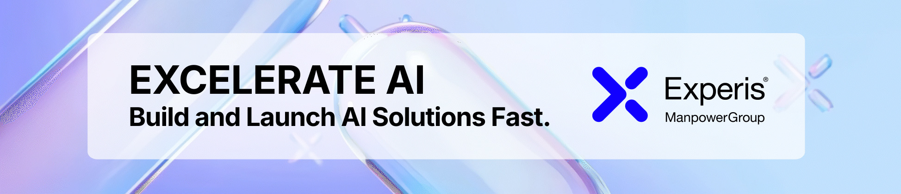

<p align="center">
  
</p>

<table>
  <tr>
    <td width="120" align="center">
      
    </td>
    <td>
      <h1>SDLC Harness</h1>
      <strong>Proactive, human-in-the-loop backlog governance powered by IBM Bob</strong><br>
      Built by <strong>Team Experis</strong> for the IBM Bobathon.
    </td>
  </tr>
</table>

<p align="center">
  
  
  
  
  
</p>

## Overview

**SDLC Harness** is an IBM Bob skill that improves the quality and traceability of GitLab
work items before gaps become delivery problems. It reviews the backlog, identifies
missing or unclear information, and brings every proposed change back to the developer
for approval inside Bob before anything is written to GitLab.

The project is self-contained: Docker Compose runs GitLab CE and a Weather Dashboard demo
application, while the Bob skill and MCP server provide the governance workflow.

```text
GitLab backlog → IBM Bob → SDLC governance agents → Human review → Safe write-back + telemetry
```

## What it does

| Capability | Value |
|---|---|
| Acceptance criteria | Drafts specific, testable Given-When-Then criteria for incomplete work items. |
| Ambiguity detection | Finds vague language and proposes concrete, reviewable wording. |
| Dependency suggestions | Identifies related or blocking issues from backlog context. |
| State transitions | Detects stale workflow states from merge-request activity. |
| Test coverage linkage | Flags work items without a configured test reference. |
| Human review and telemetry | Supports apply, edit, skip, or reject decisions and measures suggestion outcomes. |

See the [Problem Statement & Solution](docs/problem-statement.html),
[How Bob Was Used to Build This](docs/bob-usage.html), and the full
[project documentation](docs/index.html).

## Repository layout

| Directory | What it is |
|---|---|
| `gitlab-local/` | Docker stack (GitLab CE + nginx demo site) and all the scripts to start, seed, and reset it. |
| `weather-app/` | The demo artefact under governance — plain HTML/CSS/JS, no build step. |
| `bob-kit/` | Installable source and templates for the Bob skill, MCP server, rules, and mode. See "Installing the Bob skill" below. |
| `docs/` | Project documentation as self-contained HTML (`docs/index.html` is the entry point). |
| `bob_sessions/` | Screenshots of Bob task/session summaries captured during the build, kept for hackathon submission. |

## Running the demo

> **Windows users:** run every command below in **Git Bash** (installed with Git for
> Windows), not WSL or PowerShell. If you also have WSL installed, plain `bash` may
> resolve to `C:\Windows\System32\bash.exe` (the WSL launcher) instead of Git Bash —
> check with `where bash`; Git Bash's path should contain `Program Files\Git`. If it
> resolves to WSL, invoke Git Bash explicitly, e.g.
> `"C:\Program Files\Git\bin\bash.exe" bob-kit/mcp-server/install.sh`. WSL is a separate
> Linux environment with its own PATH, so tools installed on your Windows host (Node.js,
> Docker Desktop) may appear "not installed" there even when they're present on Windows.

1. Start the GitLab stack:
   ```bash
   install -m 600 gitlab-local/.env.example gitlab-local/.env
   # Set distinct GITLAB_ROOT_PASSWORD and GITLAB_DEMO_PASSWORD values.
   ./gitlab-local/manage.sh start
   ```
   `start` waits for the host-facing GitLab sign-in page, internal readiness, and the
   demo site, then runs the complete idempotent seed. `restart` performs the same checks
   and seed reconciliation. Use `./gitlab-local/manage.sh seed` to reconcile explicitly.
   Full details, including minimum host requirements and the ports each service uses, are
   in [gitlab-local/README.md](gitlab-local/README.md). To wipe and reseed at any point,
   run `./gitlab-local/manage.sh reset`.

2. Install the Bob skill (one-time, per machine):
   ```bash
   bash bob-kit/mcp-server/install.sh
   ```
   This builds and tests the skill and MCP server, merges the sdlc-harness mode and MCP
   registration without touching unrelated Bob configuration, and runs a smoke test. See
   [bob-kit/README.md](bob-kit/README.md) for the manual steps if you'd rather not run the
   installer.

   Bob uses its built-in model; there is no provider or model setup for this skill. The
   skill controls when generation is invoked, not which model runs it. It invokes
   generation for acceptance-criteria and ambiguity prose (and full-audit summarization),
   while dependency, transition, and coverage detection are deterministic.

3. Give the MCP server your GitLab credentials. It's a `stdio` server that Bob spawns
   itself (no separate process to run) — but it exits immediately if these are missing,
   which shows up in Bob as `Disconnected` with no further explanation. Add the following
   to the **repository-root** `.env` (a different file from `gitlab-local/.env` used in
   step 1). Create it with owner-only permissions, or merge these values into an existing
   file and run `chmod 600 .env`:
   ```bash
   install -m 600 bob-kit/mcp-server/.env.example .env
   ```
   ```dotenv
   GITLAB_HOST=http://localhost:8080
   GITLAB_PROJECT=sdlc-harness/weather-dashboard
   GITLAB_TOKEN=<from ./gitlab-local/manage.sh refresh-token, or a GitLab PAT>
   ```
   `./gitlab-local/manage.sh refresh-token` can mint, store, and verify the demo user's
   token without displaying it.
   Then restart Bob (or reconnect the `sdlc-harness` server from Bob's MCP settings panel).

4. In Bob, switch to the `🔧 SDLC Harness` mode and say something like `govern my backlog`.
   The skill walks through a short onboarding conversation the first time, then runs the
   agents against the seeded issues. Audits are read-only; each finding then enters an
   apply/edit/skip/reject review loop, and only apply or edit can write through the guarded
   review runtime. The full onboarding runbook is in
   [docs/onboarding/runbook.html](docs/onboarding/runbook.html).

## Maintenance

- Rotate the local API token with `./gitlab-local/manage.sh refresh-token`.
- Remove only the installed Bob skill, rule, mode, MCP registration, and build artifacts
  with `bash bob-kit/mcp-server/uninstall.sh`.
- Return the whole demo to a freshly cloned state with
  `./gitlab-local/manage.sh uninstall`; this also deletes Docker volumes, local `.env`
  files, onboarding state, and telemetry, so it prompts before proceeding.

## Team Experis

<p align="center">
  
</p>

SDLC Harness was created by **Team Experis** for the IBM Bobathon. Our goal is simple:
use agentic AI to remove SDLC friction while keeping developers in control.

<p align="center"><strong>Automate. Integrate. Deliver.</strong></p>

## Security

This repo started from IBM's hackathon project template, which ships a few guardrails to
keep credentials out of git history:

- `.gitignore` and `.bobignore` exclude every `.env` file and anything that looks like a
  credential, key, or secret by name.
- Each part of the stack that needs credentials has an `.env.example`. Create local
  `.env` files with mode `0600` (`install -m 600 ...`) and never commit them. The GitLab
  root and demo accounts must use separate passwords.
- Before pushing, check `git diff` for anything that shouldn't be there and confirm `.env`
  isn't staged (`git status`).

[Security Guidelines](docs/security.html) has the full checklist. If in doubt, ask before
pushing rather than after.
